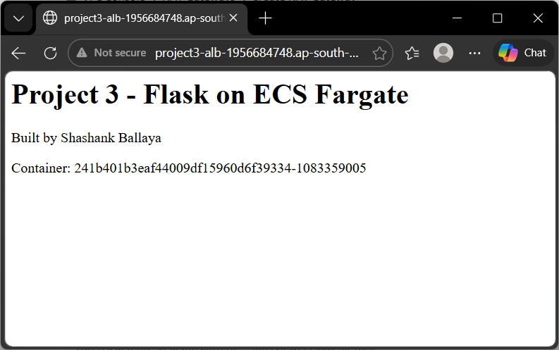
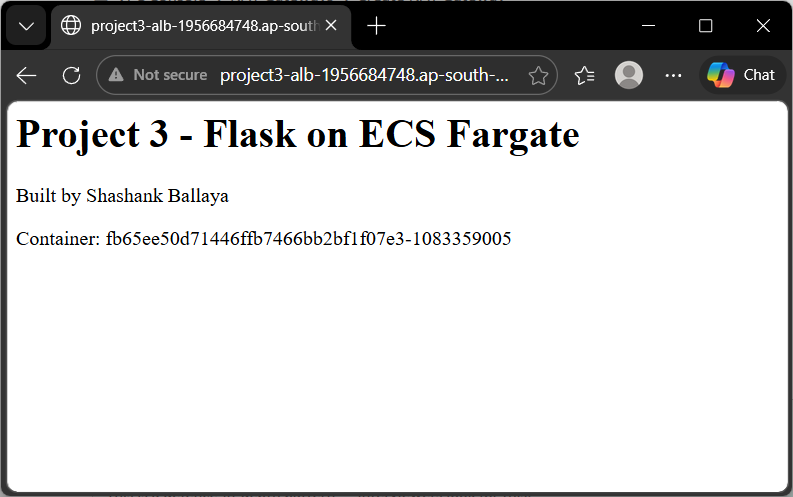
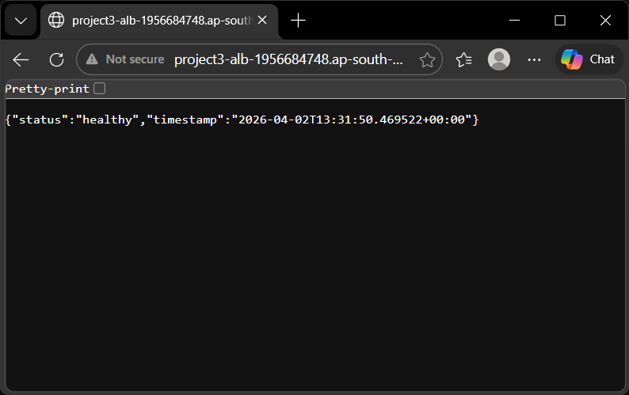
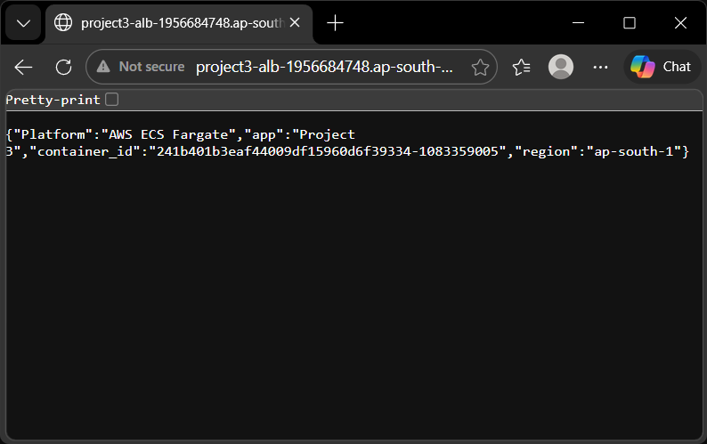
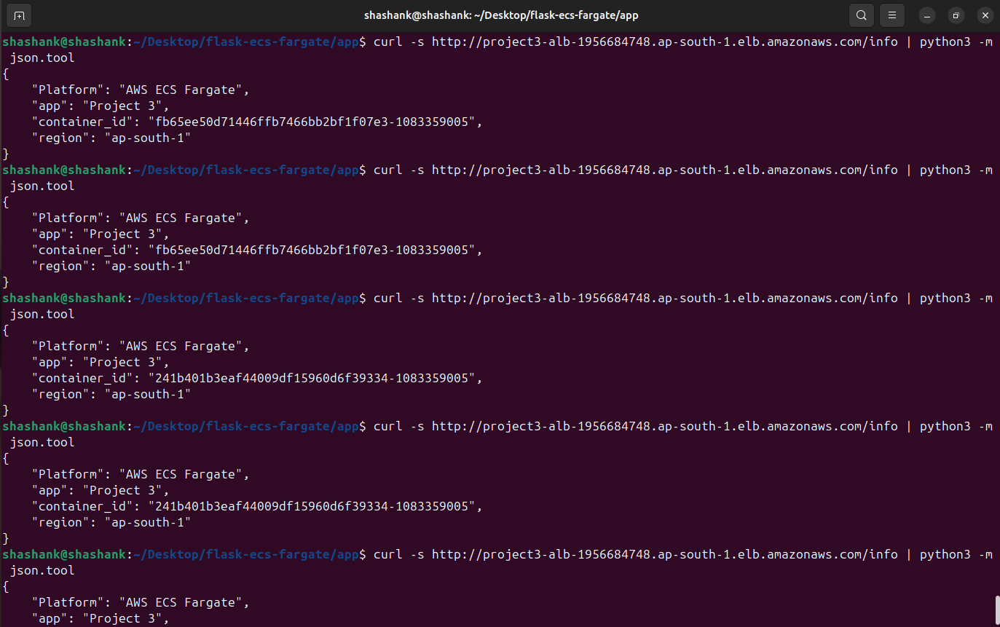

# Project 3 - Flask App on AWS ECS Fargate

Containerised Flask API with Gunicorn WSGI server, deployed to AWS ECS Fargate in private subnets. Traffic enters through an internet-facing Application Load Balancer - the sole public entry point. Fargate tasks pull container images from Amazon ECR via a NAT Gateway, with all container logs shipped to CloudWatch.

## Architecture


**Traffic flow:**

- **User requests:** Internet > ALB (public subnets, port 80) > ECS Fargate tasks (private subnets, port 5000)
- **Image pull:** ECS Fargate tasks > NAT Gateway > IGW > Amazon ECR
- **Logging:** ECS Fargate tasks > NAT Gateway > Cloudwatch Logs

## Endpoints

| Route | Method | Response |
|-------|--------|----------|
| `/` | GET | HTML home page with container ID |
| `/health` | GET | JSON `{ status, timestamp }` |
| `/info` | GET | JSON `{ app, platform, region, containerid }` |

## Tech Stack 

| Component | Purpose |
|-----------|---------|
| Flask | Python web framework |
| Gunicorn | Production WSGI server (2 workers) |
| Docker | Containerisation |
| Amazon ECR | Private container orchestration |
| ECS Fargate | Serverless container orchestration |
| Application Load Balancer | Internet-facing load balancer across 2 AZs |
| NAT Gateway | Outbound internet access for private subnets | 
| CloudWatch Logs | Container log aggregation and observability | 

## Live Deployment Evidence 

### App Running via ALB






### Laod Balancing Proof

Repeated requests to `/info` return alternating `container_id` values, confirming the ALB distributes traffic across both Fargate tasks:



### Infrastructure 

| Proof | Screenshot |
|-------|------------|
| 2 Fargate tasks in RUNNING state | [ECS Tasks](screenshots/05-ecs-tasks-running.png) |
| Both target IPs healthy | [Target Group](screenshots/07-target-group-healthy.png) |
| Container logs flowing | [CloudWatch](screenshots/06-CloudWatch-logs.png) |

## Networking 

This project uses a production networking pattern where containers are never directly exposed to the internet:

- **Private Subnets** hots all ECS Fargate tasks - no public IP assigned, no inbound internet access
- **NAT Gateway** in a public subnet gives tasks outbound-only internet access (for ECR image pulls and CloudWatch log delivery)
- **ALB** in public subnets is the sole entry point - accepts HTTP :80 and forwards to tasks in port 5000
- **Security group chaining** ensures only the ALB can reach the containers: `project3-alb-sg` (allows HTTP 80 from 0.0.0.0/0) > `project3-tasks-sg` (allows TCP 5000 from ALB security group only)

This means even if someone discovers a task's private IP, they cannot reach it directly. All traffic must pass through the ALB.

## Production Practices 

| Practice | Implementation |
|----------|----------------|
| Production WSGI server | Gunicorn with 2 workers - not Flasks's built-in dev server |
| Non-root | `USER appuser` in Dockerfile - never runs as root |
| Docker HEALTHCHECK | Built-in health check using Python urllib against `/health` |
| Layer Caching | `requirements.txt` copied and installed before app code |
| Observability | `aws-logs` driver shipping stdout/stderr to CloudWatch log group | 
| Environment variables | Region configured viw `AWS_REGION` env var - not hardcoded | 
| Structured logging | Python `logging` module with timestamp and level formatting |
| Image scanning | ECR scan-on-push enables for vulnerability detection | 

## How to Deploy

```bash 
# 1. Build the container image
cd app/
docker build -t project3-flask:v1 .

# 2. Test locally 
docker run -d -p 5000:5000 --name project3-test project3-flask:v1

# 3. Authenticate with ECR 
aws ecr get-login-password --region ap-south-1 | \
    docker login --username AWS --password-stdin \
    ACCOUNT-ID.dkr.ecr.ap-south-1.amazonaws.com

# 4. Tag and push 
docker tag project3-flask:v1 ACCOUNT-ID.dkr.ecr.ap-south-1.amazonaws.com/project3-flask:v1
docker push ACCOUNT-ID.dkr.ecr.ap-south-1.amazonaws.com/project3-flask:v1

# 5. Deploy via ECS
# Create ECS cluster, task definintion (with awslogs + execution role),
# ALB, target group, and ECS service with 2 desired task sin private subnets.
# Set health check greace period to 60 seconds.
```
